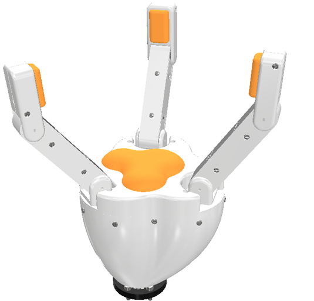
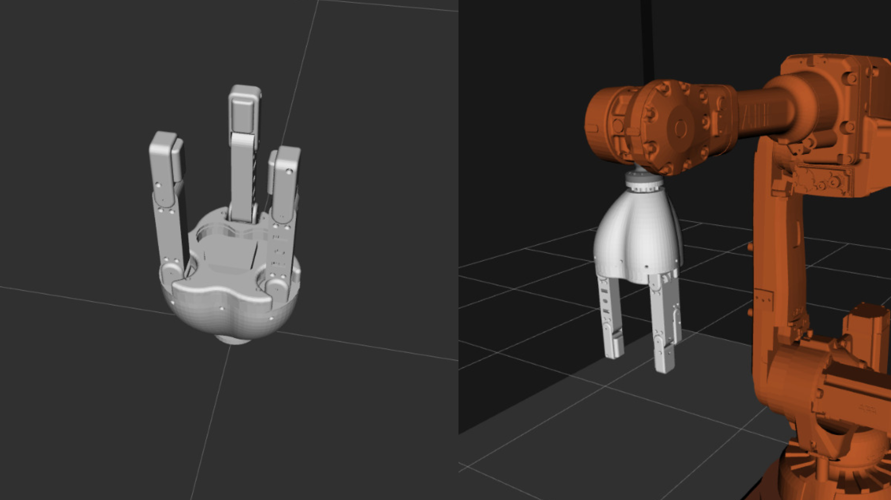

# OpenSourceThreeFingeredRoboticGripper

## Three-Fingered Gripper

This repository contains the design and implementation of a three-fingered robotic gripper, designed for precise and versatile manipulation tasks. This gripper is intended for applications in mobile and industrial robotics.

### Features

- **Compact and robust design** for adaptability to various applications.
- **Three independently moving fingers**, enabling precise manipulation.
- **High precision** for handling delicate objects of various shapes.

---

## Repository Content

### `Arduino_files` Folder

This folder contains various codes to directly control the gripper using an Arduino board. Below is a description of each file:

- **`Main_Code`**:
  - Establishes communication with the Arduino and creates an interactive menu in the Serial Plotter.
  - Allows control of the gripper's movements with predefined modes such as:
    - Cylindrical grip.
    - Pincer grip.
    - Flat grip.

- **`MoveJoints`**:
  - A file for directly moving the gripper motors using a configuration array in the format `[0, 0, 0, 0, 0, 0]`.
  - Ideal for testing and manually adjusting the motors.

- **`Prueba_1motor`**:
  - Designed for initial testing with a single motor connected.
  - Useful for validating the basic functionality of individual components.

- **`Prueba_2motor`**:
  - Similar to the previous file but for testing with two connected motors.
  - Helps verify the coordination between multiple motors.

### `ROS_files` Folder

This folder contains the necessary files to integrate and control the gripper within a ROS (Robot Operating System) environment:

- **`urdf`**:
  - Includes the `garra.xacro` file, which defines the robot's model in URDF (Unified Robot Description Format).
  - This file is essential for simulating the gripper and planning its movements in ROS.

- **`meshes`**:
  - Contains 3D models of the gripper, required for visualization in simulation tools such as RViz or Gazebo.

### `Print Designs` Folder

This folder includes the 3D designs needed to print the gripper's parts.

#### Recommended Materials:

- **PLA**: Used for structural parts due to its rigidity.
- **TPU**: Used for parts requiring flexibility, such as the finger pads.

#### Printing Instructions:

- Each design file includes a label at the end of its name, such as `x1`, `x2`, or `x3`, indicating how many times it should be printed.
- This is because some parts, like the fingers, share a repeated design.

#### Tips:

- Use appropriate print settings to achieve good quality finishes, especially for parts that directly interact with motors or sensors.
- Ensure the printed parts are compatible with the hardware before assembly.

---

## License

This repository is licensed under the MIT License. Refer to the `LICENSE` file for more information.

---

## Author

This project was developed with the goal of facilitating research and development in robotics.  
ESPOL-FIMCP-RAMEL
